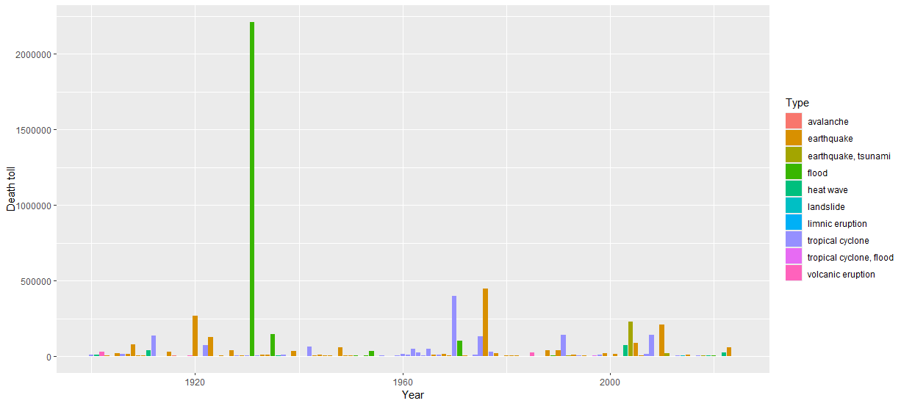

The following bar plot shows the death toll of natural disasters in each year in 20th and 21st centuries. 

In this plot, each bar corresponds to a year arranged by chronological order on the x-axis. The height of each bar indicates the death toll of a natural disaster in that year. The color of each bar indicates the type of natural disaster that occurred.
